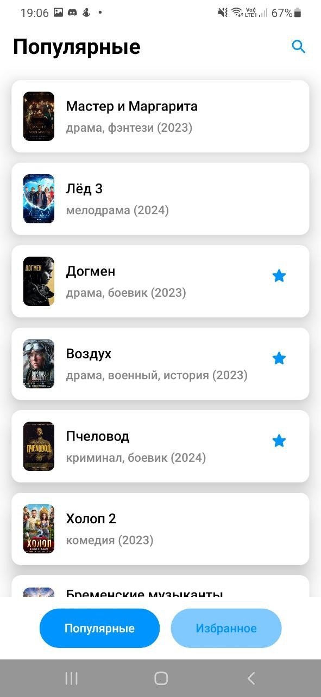
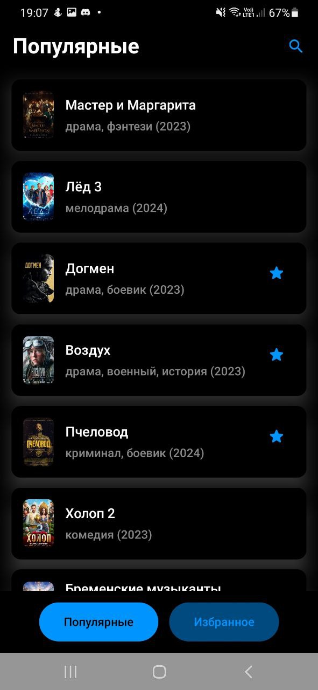
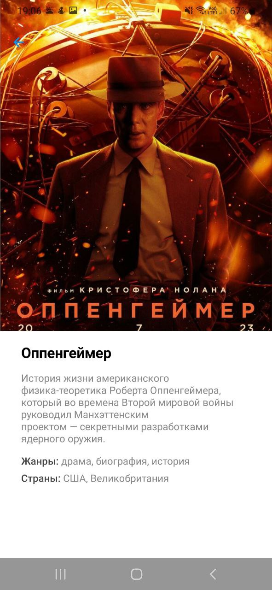
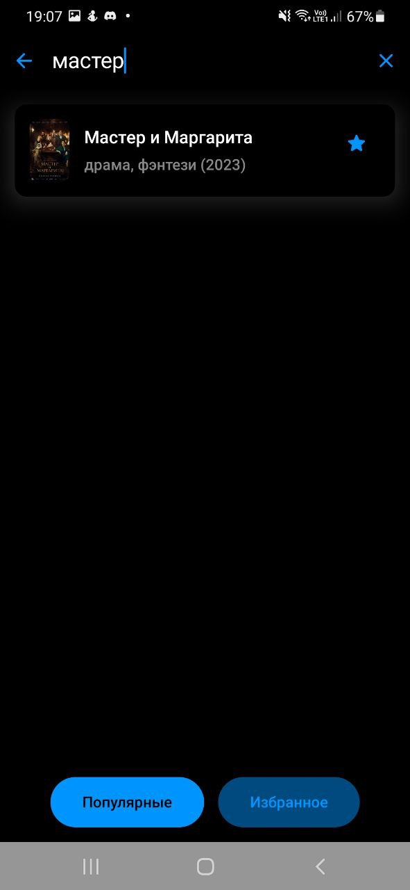

# Кинопоиск

Пример тестового проекта кинопоиск

## Функции

- На главном экране отображается список популярных фильмов.

   &nbsp; &nbsp;
  

  <em>Светлая тема</em> &nbsp; &nbsp; &nbsp; &nbsp; &nbsp; &nbsp; &nbsp; &nbsp; &nbsp; &nbsp; &nbsp; &nbsp; <em>Темная тема</em>

- При клике на карточку открывается экран с постером фильма, описанием, жанром, страной
производства.

   &nbsp; &nbsp;
  

  <em>Светлая тема</em> &nbsp; &nbsp; &nbsp; &nbsp; &nbsp; &nbsp; &nbsp; &nbsp; &nbsp; &nbsp; &nbsp; &nbsp; <em>Светлая тема</em>

- При перевороте экрана список фильмов будет занимать только 50% экрана, во второй половине
будет отображаться экран с описанием фильма.
  |  

- На главном экране присутствуют разделы «Популярное» и «Избранное». При длительном клике на
карточке, фильм помещается в избранное и хранится в базе данных. Фильмы из избранного
доступны в оффлайн режиме.

- При просмотре популярных выделяются фильмы, находящиеся в избранном.

- В разделах доступен поиск фильмов по наименованию.

  

- Лого

   &nbsp; &nbsp;
  

  <em>Светлая тема</em> &nbsp; &nbsp; &nbsp; &nbsp; &nbsp; &nbsp; &nbsp; &nbsp; &nbsp; &nbsp; &nbsp; &nbsp; <em>Темная тема</em>

## Технологический стек

- Kotlin
- Jetpack Compose
- Hilt (Dependency Injection)
- Flow (Asynchronous programming)
- Coroutine (Concurrent programming)
- Material Design
- Room (Local database)
- Retrofit (Network requests)
---
