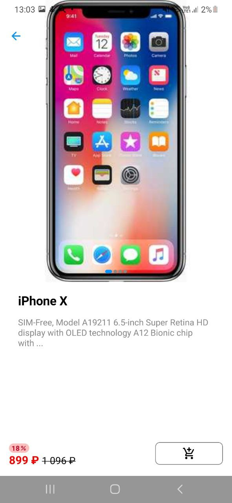
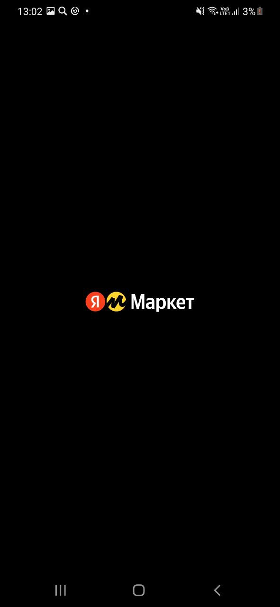

# Кинопоиск

Пример тестового проекта кинопоиск

## Функции

- На главном экране отображается список товаров.

   &nbsp; &nbsp;
  

  <em>Светлая тема</em> &nbsp; &nbsp; &nbsp; &nbsp; &nbsp; &nbsp; &nbsp; &nbsp; &nbsp; &nbsp; &nbsp; &nbsp; <em>Темная тема</em>

- При клике на карточку открывается экран с детальной продукта.

   &nbsp; &nbsp;
  

  <em>Светлая тема</em> &nbsp; &nbsp; &nbsp; &nbsp; &nbsp; &nbsp; &nbsp; &nbsp; &nbsp; &nbsp; &nbsp; &nbsp; <em>Светлая тема</em>

- При перевороте экрана список продуктов будет занимать только 50% экрана, во второй половине
будет отображаться экран с детальными.
  |  

- В разделах доступен поиск продукты и категории по наименованию.

  

- Лого

   &nbsp; &nbsp;
  

  <em>Светлая тема</em> &nbsp; &nbsp; &nbsp; &nbsp; &nbsp; &nbsp; &nbsp; &nbsp; &nbsp; &nbsp; &nbsp; &nbsp; <em>Темная тема</em>

## Технологический стек

- Kotlin
- Jetpack Compose
- Hilt (Dependency Injection)
- Flow (Asynchronous programming)
- Coroutine (Concurrent programming)
- Material Design
- Retrofit (Network requests)
---
